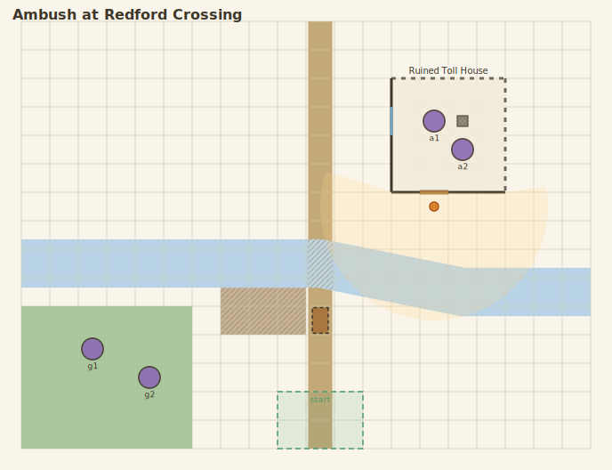

# Chartdown

**A plain-text, Markdown-inspired syntax for describing maps and charts — rendered into visuals.**

**▶ [Try it in the playground](https://nossimonov.github.io/Chartdown/)** — type Chartdown, see the map, share a link. Everything runs in your browser.

Chartdown aims to do for maps what Markdown did for documents and what Mermaid did for diagrams: let you *write* a map as readable text, keep it in version control, diff it, and render it anywhere. The initial version targets tabletop roleplaying games:

- **Fantasy maps** — regions, kingdoms, coastlines, roads, points of interest
- **Charts** — hex-based overland/travel charts, nautical charts
- **Battlemaps** — gridded tactical scenes with terrain, walls, doors, and tokens

## Why plain text?

- **Versionable** — a map lives in your campaign repo next to your session notes, and `git diff` shows exactly what changed.
- **Composable** — embed a battlemap in your prep notes the same way you embed a code block.
- **Crosslinked** — named map entities are addressable, so your prose can link to *the old bridge* on the map, and supporting renderers can link a clicked location back to its description.
- **Fast to author** — sketch an encounter map in seconds without opening a graphical editor.
- **Portable** — one source document, many renderers (SVG for the web, print-friendly output, VTT import someday).

## What it looks like

This is real, working syntax — the language is specified in [docs/spec/](docs/spec/) and this document renders today:

```chartdown
# Ambush at Redford Crossing

map: battlemap
grid: square 20x15
scale: 5ft

[terrain]
river redford "The Redford" : path A9 F9 K9 P10 T10 width=2
road tollroad "Old Toll Road" : path K1 K15
ford : on redford on tollroad difficult

[structures]
building tollhouse "Ruined Toll House" : N3..Q6
  ruined : north east
  door : O6.s

[tokens]
goblins g1 g2 : C12 E13
ogre "Gruk" : G9 size=2 hidden
party start : J14..L15
```



*The player view — "Gruk" is `hidden`, so he and every GM note are stripped; rendering with `--mode gm` shows the whole truth. The full document with GM secrets lives in [examples/redford-crossing](examples/redford-crossing/), alongside a hexcrawl, a gridless region map, a themed hexcrawl on a candy planet, and a three-story manor with a courtyard, cellar, and wall-walk.*

Note the `ford` line: it never states a position. It's placed `on` the river and `on` the road, so it *derives* the crossing — move either path and the ford follows. The same anchoring works room-by-room: `table : on kitchen at C2..D2` arranges the kitchen by the kitchen.

## Try it

**No install** — the [playground](https://nossimonov.github.io/Chartdown/) runs entirely in your browser.

**CLI** ([`@chartdown/cli`](https://www.npmjs.com/package/@chartdown/cli) on npm):

```sh
npx @chartdown/cli render map.cd -o map.svg              # player view
npx @chartdown/cli render map.cd --mode gm -o map-gm.svg # with GM secrets
npx @chartdown/cli check map.cd                          # fail-loud validation
```

**Embed in any web page** — the path this project exists for. One script tag renders every fenced ` ```chartdown ` block in place, entirely client-side:

```html
<script src="https://cdn.jsdelivr.net/npm/@chartdown/browser@0.1/dist/chartdown.browser.js" defer></script>
```

**As a library** ([`@chartdown/core`](https://www.npmjs.com/package/@chartdown/core) + [`@chartdown/render-svg`](https://www.npmjs.com/package/@chartdown/render-svg), ESM with TypeScript types, zero runtime dependencies):

```js
import { renderSource } from "@chartdown/render-svg";

const { svg, diagnostics } = renderSource(source, { mode: "gm" });
```

Working from a clone instead: `npm install && npm run build`, then `node packages/cli/dist/cli.js …` — [demo/index.html](demo/index.html) shows the embed against the local build.

## Project status

**Spec v0.1 drafted and implemented.** The specification ([sections 01–08](docs/spec/), with a [consolidated grammar](docs/spec/grammar.ebnf) and an [agent-ingestible digest](docs/spec/digest.md)) is fully implemented by the reference implementation in [packages/](packages/) — a TypeScript parser and SVG renderer, dependency-free by rule ([ADR 0007](docs/decisions/0007-typescript-stack.md)) — and every example in [examples/](examples/) renders with it. Working today:

- **Three map types**: gridded battlemaps, hex charts (ledger-style exploration logs), and gridless region maps with organic, seeded rendering
- **The GM/player split**: `hidden`, `gm=`, and `[gm]` content strips fail-closed from player renders
- **Battlemap depth**: walls/doors/windows with light and sight, derived crossings, elevation with fall edges, multi-level structures (floors, connectors, cellars, roofs), room-relative placement
- **Themes as Chartdown documents**: appearance lives in swappable theme files, not in the map
- **Tooling**: a CLI (`render`, `check`), a browser embed that renders fenced ` ```chartdown ` blocks in place, and the [client-side playground](https://nossimonov.github.io/Chartdown/)

All four packages are [on npm under `@chartdown`](https://www.npmjs.com/org/chartdown). Not yet: UVTT export, editor integrations (Obsidian, remark/markdown-it). See the [roadmap](docs/roadmap.md) for the plan and the [issue tracker](https://github.com/Nossimonov/Chartdown/issues) for what's in flight.

## Repository layout

| Path | Purpose |
|---|---|
| [docs/vision.md](docs/vision.md) | Goals, non-goals, and success criteria |
| [docs/roadmap.md](docs/roadmap.md) | Phased plan from vision to working renderer |
| [docs/spec/](docs/spec/) | The Chartdown language specification (drafts live here) |
| [docs/decisions/](docs/decisions/) | Architecture Decision Records — why things are the way they are |
| [examples/](examples/) | Example Chartdown documents, written spec-first |
| [packages/](packages/) | Reference implementation (TypeScript): `core` (parser/AST), `render-svg`, `cli`, `browser` |
| [demo/](demo/) | Plain-HTML fenced-block rendering demo |
| [playground/](playground/) | The client-side playground, deployed to [nossimonov.github.io/Chartdown](https://nossimonov.github.io/Chartdown/) |
| [CONTRIBUTING.md](CONTRIBUTING.md) | Issue-tracking rules and the syntax-proposal process |

## Contributing

This project runs **issue-first and spec-first** — see [CONTRIBUTING.md](CONTRIBUTING.md) before opening a PR. Syntax ideas are especially welcome as [syntax proposal issues](CONTRIBUTING.md#syntax-proposals).

## License

[MIT](LICENSE), with one carve-out: the language specification in [docs/spec/](docs/spec/) is [CC-BY-4.0](https://creativecommons.org/licenses/by/4.0/), so anyone can implement or republish the spec with attribution. Rationale in [ADR 0001](docs/decisions/0001-mit-code-cc-by-spec.md).
