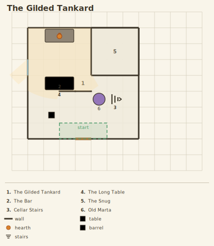

# The Gilded Tankard

**Status: spec-aligned.**

A one-room inn showcasing the labeling machinery: `labels: keyed` numbers every named entity module-style (with `key=5` pinning the Snug so published references survive edits), the key list renders in the legend band, and `legend: on` adds vocabulary samples from the words actually used. Also exercises: a derived word keeping its base's glyph and light (`hearth : campfire`), a freestanding wall run (the bar), a footprint feature with default facet light, and directional stairs (`facing=e`).

| | |
|---|---|
| Player view |  |
| GM view |  |
