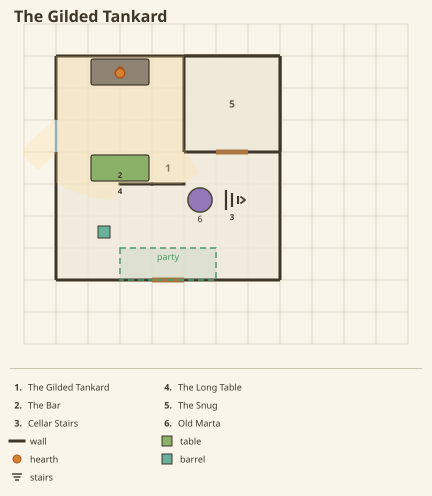

# The Gilded Tankard

**Status: spec-aligned.**

A one-room inn showcasing the labeling machinery: `labels: keyed` numbers every named entity module-style (with `key=5` pinning the Snug so published references survive edits), the key list renders in the legend band, and `legend: on` adds vocabulary samples from the words actually used. Also exercises: a derived word keeping its base's glyph and light (`hearth : campfire`), a freestanding wall run (the bar), a footprint feature with default facet light, and directional stairs (`facing=e`).

| | |
|---|---|
| Player view |  |
| GM view |  |

## With the alternative theme

[`gilded-tankard-vellum.theme.cd`](gilded-tankard-vellum.theme.cd) renders this map in **ink and vellum** — sepia on aged paper, hatched rather than flat:

```sh
chartdown render gilded-tankard.cd --theme gilded-tankard-vellum.theme.cd
```

It is a three-line overlay on [the travelling theme](../ink-and-vellum.theme.cd), which is keyed entirely on standard-library words and restyles all seven examples without knowing any of them. `use:` is not decoration here: it makes the base an **inherited** layer, which is what spec 08 §6 exempts from the dead-declaration lint — a shared theme deliberately styles words no single map uses, and selected directly it reports every one of them (69 on Brenmark). `hearth : campfire` is this document's own word and the common room's light as well as its furniture, so the overlay gives it a mark of its own.

No themed SVG is committed; the theme is live in [the playground](https://nossimonov.github.io/Chartdown/) under the Theme selector.
